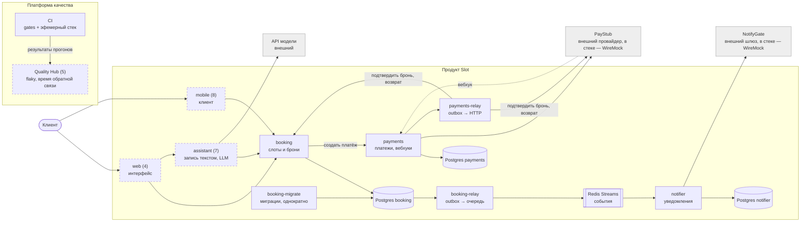

# Архитектура Slot

Slot — сервис записи на услуги: клиент выбирает свободное время у мастера, оплачивает и получает уведомление. Продукт намеренно тонкий. Он существует как объект тестирования для платформы качества.

## Целевая схема

Сплошная рамка — уже есть. Пунктир — запланировано, в скобках номер итерации.

## Где какая архитектурная проблема

| Часть | Проблема | Чем проверяем |
|---|---|---|
| booking + Postgres | Двое бронируют один слот одновременно | Тесты на гонки, ограничения на уровне базы |
| payments | Чужой API, повторные вебхуки | Контрактные тесты, заглушка провайдера, идемпотентность |
| outbox + очередь + notifier | Потерянные и повторные сообщения, зависшие и «ядовитые» | Тесты событий: недоступный брокер, дубликат, обратный порядок, падение до и после отправки, очередь ошибок |
| assistant | Недетерминизм, prompt-инъекции | Evals: проверки кодом по структурированному ответу |
| web, mobile | Хрупкие UI-тесты | Минимум e2e, доступность, визуальная регрессия |

## Правила

- Сервисы общаются только по сети, общего кода нет (ADR-0002).
- Каждый сервис отдаёт `/health` с версией и коммитом сборки (ADR-0003).
- У каждого сервиса своя база; чужие таблицы не читаются.
- Повторы безопасны: дубликаты разводят естественные ключи в базе (ADR-0008).
- Наружу сервис сообщает через outbox: сообщение пишется той же транзакцией, что и изменение, и отправляется отдельным процессом (ADR-0010). Доменный код не знает про брокер.
- Доставка — «хотя бы один раз». Получатель идемпотентен, значит, повтор безопасен; «ровно один раз» не обещается никому.
- Правила, которые нельзя нарушать, гарантирует база, а не код (ADR-0005). Схема меняется только миграциями, их применяет отдельный одноразовый контейнер (ADR-0006).
- Решения, которые дорого отменить, записываются в `docs/adr`.
